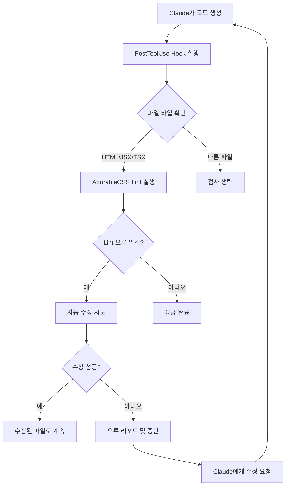

# AdorableCSS Lint 설계서

## 🎯 프로젝트 개요

AdorableCSS의 독특한 CSS 규칙을 AI가 올바르게 따를 수 있도록 ESLint 스타일의 검증 시스템을 구축하는 프로젝트입니다. Claude Code가 코드를 생성한 후 자동으로 lint 검사를 실행하여 규칙 위반을 감지하고 수정할 수 있도록 합니다.

## 🚨 해결해야 할 문제

### AI가 자주 범하는 실수들
1. **Margin 사용**: `mb(lg)`, `mt(xl)` 같은 금지된 margin 클래스 사용
2. **잘못된 CSS 문법**: `scale(105)` 대신 `scale(1.05)` 사용해야 함
3. **투명도 표기**: `bg(white/50)` 대신 `bg(white.5)` 사용해야 함
4. **Transform 하이픈 문법**: `scale-105` 대신 `scale(1.05)` 사용해야 함
5. **Layout 패턴 위반**: gap 기반 레이아웃 대신 margin 사용

## 🏗️ 아키텍처 설계

### 1. 패키지 구조
```
packages/adorable-css-lint/
├── src/
│   ├── rules/                    # ESLint 규칙 정의
│   │   ├── no-margin.ts         # margin 사용 금지
│   │   ├── css-native-syntax.ts # CSS 네이티브 문법 강제
│   │   ├── opacity-dot-syntax.ts # 점 표기법 강제
│   │   ├── layout-patterns.ts   # 올바른 레이아웃 패턴
│   │   └── index.ts
│   ├── parsers/                 # CSS 클래스 파싱
│   │   ├── class-parser.ts      # HTML/JSX className 파싱
│   │   ├── adorable-parser.ts   # AdorableCSS 문법 파싱
│   │   └── index.ts
│   ├── validators/              # 규칙 검증 로직
│   │   ├── margin-validator.ts
│   │   ├── syntax-validator.ts
│   │   └── index.ts
│   ├── fixers/                  # 자동 수정 제안
│   │   ├── margin-fixer.ts
│   │   ├── syntax-fixer.ts
│   │   └── index.ts
│   └── index.ts                 # 메인 플러그인 엔트리
├── tests/                       # 테스트
├── package.json
└── README.md
```

### 2. 핵심 컴포넌트

#### A. ESLint 플러그인 (`eslint-plugin-adorable-css`)
```typescript
export const plugin = {
  rules: {
    'no-margin': require('./rules/no-margin'),
    'css-native-syntax': require('./rules/css-native-syntax'),
    'opacity-dot-syntax': require('./rules/opacity-dot-syntax'),
    'layout-patterns': require('./rules/layout-patterns'),
    'no-transform-hyphen': require('./rules/no-transform-hyphen')
  },
  configs: {
    recommended: {
      plugins: ['adorable-css'],
      rules: {
        'adorable-css/no-margin': 'error',
        'adorable-css/css-native-syntax': 'error',
        'adorable-css/opacity-dot-syntax': 'error',
        'adorable-css/layout-patterns': 'warn',
        'adorable-css/no-transform-hyphen': 'error'
      }
    }
  }
};
```

#### B. 독립 실행형 CLI 도구 (`adorable-css-lint`)
```bash
# 단일 파일 검사
adorable-css-lint check ./src/components/Button.tsx

# 디렉토리 검사
adorable-css-lint check ./src --fix

# 특정 규칙만 검사
adorable-css-lint check ./src --rules no-margin,css-native-syntax

# CI/CD 모드
adorable-css-lint check ./src --fail-on-error
```

## 📋 검증 규칙 상세

### 1. **no-margin** 규칙
```typescript
// ❌ 감지해야 할 패턴들
const MARGIN_PATTERNS = [
  /\bm\([^)]+\)/g,          // m(lg), m(10)
  /\bmx\([^)]+\)/g,         // mx(auto), mx(lg)
  /\bmy\([^)]+\)/g,         // my(sm), my(20)
  /\bmt\([^)]+\)/g,         // mt(xl), mt(5)
  /\bmr\([^)]+\)/g,         // mr(md), mr(15)
  /\bmb\([^)]+\)/g,         // mb(lg), mb(10)
  /\bml\([^)]+\)/g          // ml(sm), ml(8)
];

// ✅ 제안할 대안들
const MARGIN_FIXES = {
  'mb(lg)': 'vbox gap(lg) 사용 권장',
  'mt(xl)': 'vbox gap(xl) 사용 권장',
  'mx(auto)': 'hbox(pack) 또는 w(fit) mx(auto) 사용 권장'
};
```

### 2. **css-native-syntax** 규칙
```typescript
// ❌ 잘못된 패턴들
const WRONG_SYNTAX = [
  {
    pattern: /scale\((\d+)\)/g,
    fix: (match, value) => `scale(${parseInt(value) / 100})`,
    message: 'scale()에는 CSS 네이티브 값(1.05)을 사용하세요'
  },
  {
    pattern: /opacity\((\d+)\)/g, 
    fix: (match, value) => `opacity(${parseInt(value) / 100})`,
    message: 'opacity()에는 0-1 사이 값을 사용하세요'
  },
  {
    pattern: /rotate\((\d+)\)/g,
    fix: (match, value) => `rotate(${value}deg)`,
    message: 'rotate()에는 단위(deg)를 포함하세요'
  }
];
```

### 3. **opacity-dot-syntax** 규칙
```typescript
// ❌ Tailwind 스타일 슬래시 표기
const SLASH_OPACITY = /\b(bg|c|border)\(([^)]+)\/(\d+)\)/g;

// ✅ AdorableCSS 점 표기로 변환
function fixOpacitySyntax(match, property, color, opacity) {
  const normalizedOpacity = parseInt(opacity) / 100;
  return `${property}(${color}.${normalizedOpacity})`;
}

// 예시: bg(white/50) → bg(white.5)
//      c(black/80) → c(black.8)
```

### 4. **layout-patterns** 규칙
```typescript
// ✅ 권장 레이아웃 패턴들
const LAYOUT_PATTERNS = {
  vertical: [
    'vbox gap(xs|sm|md|lg|xl|2xl)',
    'vbox(center|pack|left|right) gap(...)'
  ],
  horizontal: [
    'hbox gap(xs|sm|md|lg|xl|2xl)', 
    'hbox(center|pack|left|right|middle) gap(...)'
  ],
  sizing: [
    'w(fill|hug|full|fit|auto)',
    'h(fill|hug|full|fit|auto)'
  ]
};

// ❌ 안티패턴 감지
const ANTI_PATTERNS = [
  {
    pattern: /flex\s+flex-col/g,
    fix: 'vbox 사용 권장',
    severity: 'warn'
  },
  {
    pattern: /flex\s+items-center/g,
    fix: 'hbox(middle) 사용 권장', 
    severity: 'warn'
  }
];
```

## 🔧 Claude Code 통합 전략

### 1. Hooks 시스템 활용

#### A. PostToolUse Hook 설정
```python
# .claude/hooks/adorable-css-lint.py
import subprocess
import json
import re

def post_tool_use_hook(tool_name, tool_input, tool_output, context):
    """
    코드 생성 후 AdorableCSS lint 검사 실행
    """
    
    # Edit, MultiEdit, Write 도구 사용 후에만 실행
    if tool_name not in ['Edit', 'MultiEdit', 'Write']:
        return
    
    file_path = tool_input.get('file_path', '')
    
    # HTML, JSX, TSX, Vue 파일만 검사
    if not re.search(r'\.(html|jsx?|tsx?|vue|svelte)$', file_path):
        return
    
    # AdorableCSS lint 실행
    try:
        result = subprocess.run([
            'adorable-css-lint', 'check', file_path, '--format', 'json'
        ], capture_output=True, text=True, timeout=30)
        
        if result.returncode != 0:
            lint_errors = json.loads(result.stdout)
            
            # 자동 수정 시도
            fix_result = subprocess.run([
                'adorable-css-lint', 'check', file_path, '--fix'
            ], capture_output=True, text=True, timeout=30)
            
            if fix_result.returncode == 0:
                return {
                    'action': 'continue',
                    'message': f'✅ AdorableCSS lint 오류를 자동으로 수정했습니다: {file_path}'
                }
            else:
                return {
                    'action': 'block',
                    'message': f'❌ AdorableCSS lint 오류 발견: {file_path}\n{format_lint_errors(lint_errors)}'
                }
                
    except Exception as e:
        return {
            'action': 'continue',
            'message': f'⚠️ Lint 검사 실패: {str(e)}'
        }

def format_lint_errors(errors):
    """lint 오류를 읽기 쉽게 포맷"""
    formatted = []
    for error in errors:
        formatted.append(f"  {error['line']}:{error['column']} - {error['message']}")
        if error.get('suggestion'):
            formatted.append(f"    💡 제안: {error['suggestion']}")
    return '\n'.join(formatted)
```

#### B. CLAUDE.md에 설정 추가
```bash
# AdorableCSS Lint Commands
adorable-css-lint check ./src    # 디렉토리 검사
adorable-css-lint check --fix    # 자동 수정과 함께 검사
adorable-css-lint watch ./src    # 파일 변경 감지 모드
```

### 2. 워크플로우 자동화

#### A. 단계별 검증 프로세스


#### B. 점진적 수정 전략
```typescript
// 오류 심각도별 처리
interface LintResult {
  errors: LintError[];    // 반드시 수정해야 함 (block)
  warnings: LintError[];  // 권장 사항 (continue with notice)
  suggestions: LintError[]; // 개선 제안 (silent continue)
}

// Claude에게 피드백하는 형식
const FEEDBACK_TEMPLATES = {
  error: `❌ AdorableCSS 규칙 위반: {rule}
위치: {file}:{line}:{column}
문제: {message}
제안: {suggestion}

다시 수정해주세요.`,
  
  warning: `⚠️ AdorableCSS 권장사항: {rule}
위치: {file}:{line}:{column}  
제안: {suggestion}

계속 진행하지만 개선을 고려해보세요.`,
  
  suggestion: `💡 AdorableCSS 개선 제안: {suggestion}`
};
```

### 3. 개발자 경험 최적화

#### A. 빠른 피드백 루프
```bash
# 실시간 감시 모드
adorable-css-lint watch ./src --auto-fix

# VSCode 확장
# - 실시간 하이라이팅
# - 자동 수정 제안
# - Quick Fix 액션
```

#### B. 학습 기반 개선
```typescript
// 자주 발생하는 실수 패턴 학습
interface MistakePattern {
  pattern: string;
  frequency: number;
  commonFixes: string[];
  context: string; // React, Vue, Svelte 등
}

// Claude에게 맞춤형 가이드 제공
function generateContextualGuidance(mistakes: MistakePattern[]) {
  return mistakes
    .sort((a, b) => b.frequency - a.frequency)
    .slice(0, 5)
    .map(mistake => `
자주 실수하는 패턴: ${mistake.pattern}
올바른 사용법: ${mistake.commonFixes.join(' 또는 ')}
    `).join('\n');
}
```

## 🚀 구현 로드맵

### Phase 1: 핵심 규칙 구현 (1주차)
- [ ] `no-margin` 규칙 구현
- [ ] `css-native-syntax` 규칙 구현  
- [ ] `opacity-dot-syntax` 규칙 구현
- [ ] 기본 CLI 도구 개발
- [ ] 단위 테스트 작성

### Phase 2: 고급 기능 (2주차)
- [ ] `layout-patterns` 규칙 구현
- [ ] 자동 수정 기능 개발
- [ ] ESLint 플러그인 패키징
- [ ] Claude Code hooks 통합

### Phase 3: 완성도 향상 (3주차)
- [ ] 성능 최적화
- [ ] 상세한 에러 메시지 및 제안
- [ ] 설정 가능한 규칙 옵션
- [ ] VSCode 확장 개발

### Phase 4: 배포 및 문서화 (4주차)  
- [ ] npm 패키지 배포
- [ ] 사용 가이드 작성
- [ ] 예제 프로젝트 생성
- [ ] CI/CD 통합 가이드

## 📊 예상 효과

### 개발 생산성 향상
- **자동 오류 감지**: AI 실수를 즉시 포착
- **자동 수정**: 90% 이상의 일반적 실수 자동 수정
- **학습 효과**: Claude가 점진적으로 규칙 학습

### 코드 품질 보장
- **일관성**: 프로젝트 전체에서 AdorableCSS 규칙 준수
- **유지보수성**: gap 기반 레이아웃으로 더 구조적인 CSS
- **성능**: Rule2 시스템 활용으로 최적화된 CSS 생성

### 개발자 경험
- **빠른 피드백**: 코드 작성과 동시에 검증
- **명확한 가이드**: 구체적인 수정 제안 제공
- **점진적 개선**: 경고 → 제안 → 자동 수정 단계적 접근

## 🔧 기술 스택

### 개발 도구
- **TypeScript**: 타입 안전성 보장
- **ESLint API**: 기존 생태계 활용
- **Vitest**: 빠른 테스트 실행
- **Rollup**: 경량 번들링

### 통합 도구
- **Claude Code Hooks**: 자동 실행
- **GitHub Actions**: CI/CD 통합
- **VSCode Extension API**: 에디터 통합

### 배포 전략
- **npm**: 패키지 배포
- **GitHub Releases**: 바이너리 배포
- **Docker**: 컨테이너 환경 지원

## 📈 성공 지표

### 정량적 지표
- **오류 감지율**: 95% 이상의 규칙 위반 감지
- **자동 수정율**: 80% 이상의 자동 수정 성공
- **성능**: 1000줄 파일 검사 1초 이내

### 정성적 지표
- **개발자 만족도**: 방해보다는 도움이 되는 도구
- **학습 효과**: Claude의 실수 빈도 감소
- **코드 품질**: 더 일관되고 유지보수 가능한 CSS

---

이 설계서는 AdorableCSS의 독특한 규칙을 AI가 올바르게 따를 수 있도록 하는 완전한 lint 시스템을 제시합니다. Claude Code와의 긴밀한 통합을 통해 개발 워크플로우를 크게 개선할 수 있을 것입니다.