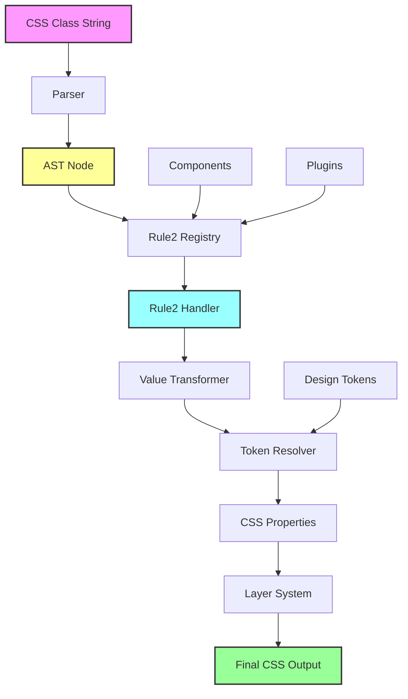

# AdorableCSS Workflow Analysis

## Overview

AdorableCSS is a CSS framework that transforms CSS-like class names into optimized CSS output through a sophisticated parsing and compilation pipeline. The framework emphasizes performance through its Rule2 system and provides a layered architecture for CSS generation.

## Architecture Overview

### Directory Structure
```
packages/adorable-css/
├── 01-core/         # Core parsing and utilities
├── 02-design_tokens/ # Token system and design values
├── 03-values/       # Value processing and transformation
├── 04-rules/        # Rule handlers (Rule2 system)
├── 05-components/   # Component definitions
├── 06-plugins/      # Extensions (responsive, animations)
└── 07-generator/    # CSS generation and output
```

## Workflow Diagram



## Detailed Workflow Steps

### 1. Input Processing (`generateCSS`)
- Entry point: `packages/adorable-css/src/07-generator/generator.ts`
- Accepts an array of CSS class strings
- Initializes Rule2 handlers lazily
- Manages token tracking and registry

### 2. Parsing (`parseAdorableCSS`)
- Location: `packages/adorable-css/src/01-core/parser/parser.js`
- Tokenizes input using regex patterns
- Creates an Abstract Syntax Tree (AST)
- Supports various syntax types:
  - Functions: `p(md)`, `text(lg/1.5)`
  - Keywords: `hidden`, `block`
  - CSS literals: `{display:flex}`
  - Ranges: `text(sm..lg)`
  - Compound values: `text(nowrap+center)`

### 3. AST Structure
Example AST for `p(md)`:
```javascript
{
  type: 'selector',
  selector: {
    type: 'function',
    name: 'p',
    args: [{
      type: 'ident',
      image: 'md'
    }]
  }
}
```

### 4. Rule Resolution
- Rule2 Registry maps rule names to handlers
- Three layers:
  - `utilities`: Basic CSS properties
  - `composition`: Multi-property shortcuts
  - `components`: Complex component styles

### 5. Rule2 Handler Processing
- Handlers receive AST nodes directly (performance optimization)
- Return CSS property strings
- Example handler for padding:
```typescript
export const p = rule2(s => safeCss('padding', getSideValues(s, spacing)));
```

### 6. Value Transformation Pipeline
1. **Extract values from AST**: `getFirstValue()`, `getAllValues()`
2. **Transform values**: Apply token resolution
3. **Token types**:
   - `spacing`: Spacing scale (xs, sm, md, lg, xl)
   - `font`/`text`: Typography scale
   - `size`: Size tokens
   - `color`: Color palette

### 7. Token Resolution
- Checks if value is a design token
- Returns CSS variable: `var(--spacing-md)`
- Falls back to raw value with units

### 8. CSS Generation
- Groups CSS by layers using `@layer`
- Layer order: `base, components, composition, utilities`
- Handles responsive modifiers: `md:p(lg)`
- Handles state modifiers: `hover:bg(red)`
- Removes duplicate selectors

### 9. Component System
- Components are registered as Rule2 handlers
- Component definitions expand to utility classes
- Example: `btn(primary)` → `hbox() px(md) py(sm) bg(primary) c(white)`

### 10. Output
Final CSS includes:
- CSS custom properties (design tokens)
- Reset CSS in base layer
- Layered CSS rules
- Importance handling (`!` modifier)

## Key Features

### Performance Optimizations
- **Rule2 System**: Direct AST → CSS transformation
- **Memoization**: Caches generated CSS
- **Lazy initialization**: Handlers loaded on demand
- **No intermediate objects**: Reduces memory allocation

### State & Responsive System
- **State classes**: `hover:`, `focus:`, `group-hover:`
- **Responsive classes**: `sm:`, `md:`, `lg:`
- **Compound states**: `md:hover:bg(red)`

### Token System
- Minimal, hardcoded tokens (Tailwind-compatible)
- Dynamic token generation for numeric values
- CSS custom properties for all tokens

### Component Architecture
- Primitive components (button, card, input)
- Pattern components (section, container, hero)
- Composable through utility classes

## Example Flow

Input: `hbox() gap(md) p(lg) bg(primary.5)`

1. **Parse**: Creates AST with 4 selector nodes
2. **Process each**:
   - `hbox()` → `display:flex;flex-direction:row;align-items:center`
   - `gap(md)` → `gap:var(--spacing-md)`
   - `p(lg)` → `padding:var(--spacing-lg)`
   - `bg(primary.5)` → `background-color:color-mix(in oklch, var(--color-primary), transparent 50%)`
3. **Layer**: Group by utilities/composition layers
4. **Output**: Layered CSS with proper specificity

## Summary

AdorableCSS provides a sophisticated transformation pipeline that:
1. Parses intuitive CSS-like syntax
2. Transforms through performant Rule2 handlers
3. Resolves design tokens
4. Generates layered, optimized CSS
5. Supports components, states, and responsive design

The architecture emphasizes performance, modularity, and developer experience while maintaining CSS standards compliance.